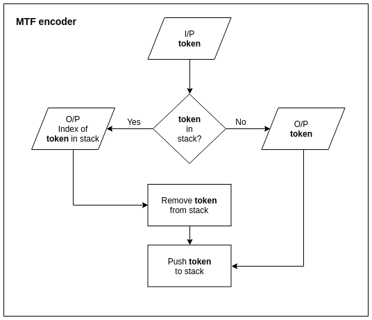
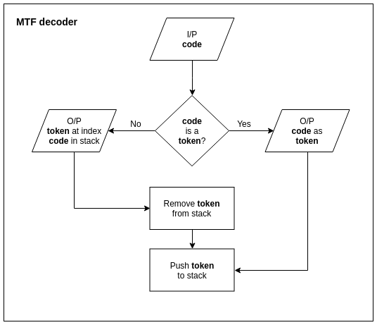

# Compressors
## MTF encoder
~~~~bash
# Compress
./tokenizer -t -l English -i ip_file | ./mtf -e -l English | ./comb -c -l MTF -o op_file

# Character count
wc -c ip_file op_file

# Decompress
./comb -s -l MTF -i op_file | ./mtf -d -l English | ./tokenizer -d -l English -o ip_file1

# Verify
diff ip_file ip_file1
~~~~
## MTF flow chart

